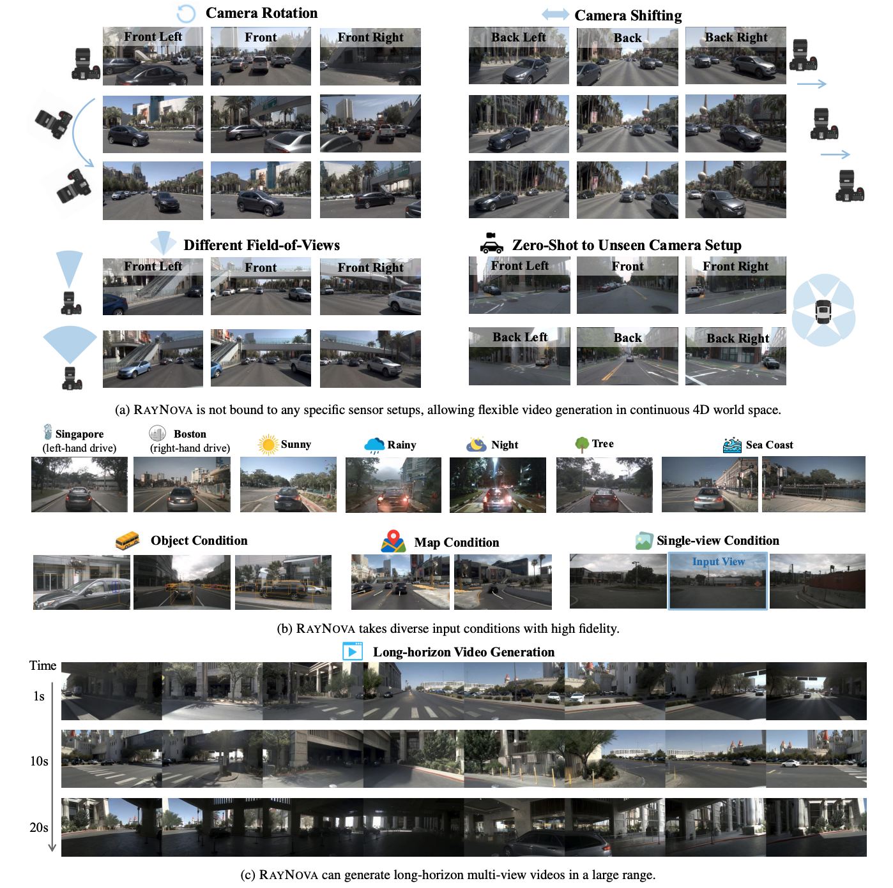
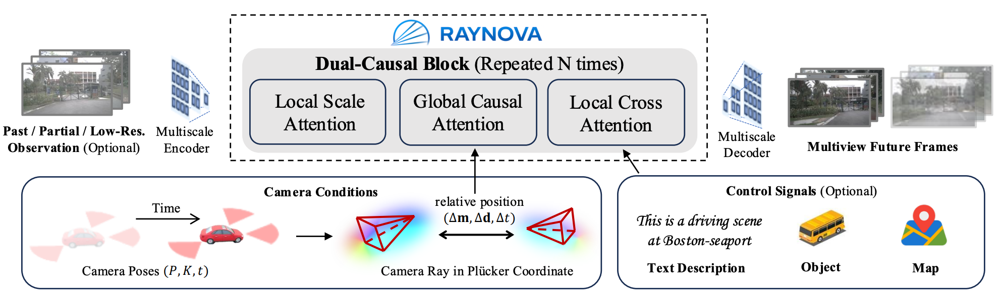

This repo is deprecated and we will have a new repo for code release soon!

# [CVPR 2026] RAYNOVA: Scale-Temporal Autoregressive World Modeling in Ray Space

## Abstract
World foundation models aim to simulate the evolution of the real world with physically plausible behavior. Unlike prior methods that handle spatial and temporal correlations separately, we propose RAYNOVA, a geometry-agonistic multiview world model for driving scenarios that employs a dual-causal autoregressive framework. It follows both scale-wise and temporal topological orders in the autoregressive process, and leverages global attention for unified 4D spatio-temporal reasoning. Different from existing works that impose strong 3D geometric priors, RAYNOVA constructs an isotropic spatio-temporal representation across views, frames, and scales based on relative Plücker-ray positional encoding, enabling robust generalization to diverse camera setups and ego motions. We further introduce a recurrent training paradigm to alleviate distribution drift in long-horizon video generation. RAYNOVA achieves state-of-the-art multi-view video generation results on nuScenes, while offering higher throughput and strong controllability under diverse input conditions, generalizing to novel views and camera configurations without explicit 3D scene representation.

### Code is coming soon.
